# REALTIME_DATA_STREAMING

## Project Overview
This project demonstrates a real-time data streaming pipeline, covering all phases from **data ingestion** to **processing** and **storage**. The stack includes:

- **Apache Airflow**: Workflow orchestration to trigger and manage tasks.
- **Apache Kafka**: Distributed message broker for real-time data ingestion.
- **Apache Zookeeper**: Coordinates Kafka brokers.
- **Apache Spark**: Real-time stream processing.
- **Cassandra**: A NoSQL database for efficient data storage.
- **Docker**: Containerization for easy deployment and scalability.
- **Python**: For scripting and custom logic implementation.

---

## Project Structure
```
REALTIME_DATA_STREAMING/
│
├── architecture/          # Architecture-related files (e.g., configurations)
│   ├── cassandra/         # Cassandra configurations
│   ├── docker/            # Docker images, setup files
│   ├── kafka/             # Kafka setup configurations
│   └── spark/             # Spark setup files
│
├── dags/                  # Airflow DAGs
│   ├── __pycache__/       # Compiled Python cache files
│   └── kafka_stream.py    # Kafka stream ingestion DAG
│
├── script/                # Shell scripts
│   └── entrypoint.sh      # Entry point script for container startup
│
├── venv/                  # Virtual environment for dependencies
│
├── docker-compose.yml     # Docker Compose file to orchestrate services
├── README.md              # Project documentation
├── requirements.txt       # Python dependencies
└── spark_stream.py        # Spark streaming logic
```

---

## Tools & Technologies
1. **Apache Kafka**
   - Handles real-time data ingestion through topic-based messaging.
2. **Apache Zookeeper**
   - Ensures coordination between Kafka brokers.
3. **Apache Spark**
   - Processes the streaming data in real-time.
4. **Cassandra**
   - Stores processed data efficiently.
5. **Apache Airflow**
   - Manages the entire pipeline workflow.
6. **Docker-Compose**
   - Streamlines deployment of all components as containers.
7. **Python**
   - Core programming language for scripting and orchestration.

---

## Installation & Setup
### Prerequisites
Ensure you have the following installed:
- Docker & Docker Compose
- Python 3.x

### Steps to Run the Project
1. **Clone the repository**:
   ```bash
   git clone <repository_url>
   cd REALTIME_DATA_STREAMING
   ```

2. **Create Python virtual environment**:
   ```bash
   python -m venv venv
   source venv/bin/activate   # For Linux/Mac
   venv\Scripts\activate      # For Windows
   ```

3. **Install Python dependencies**:
   ```bash
   pip install -r requirements.txt
   ```

4. **Start all services using Docker Compose**:
   ```bash
   docker-compose up --build
   ```
   This command will spin up all necessary containers (Kafka, Zookeeper, Spark, Cassandra, Airflow, etc.).

5. **Access Services**:
   - **Airflow**: `http://localhost:8080`
   - **Kafka**: Broker on `localhost:9092`
   - **Spark UI**: `http://localhost:4040`
   - **Cassandra**: Port `9042`

---

## Workflow

1. **Kafka**: Real-time data is ingested into Kafka topics.
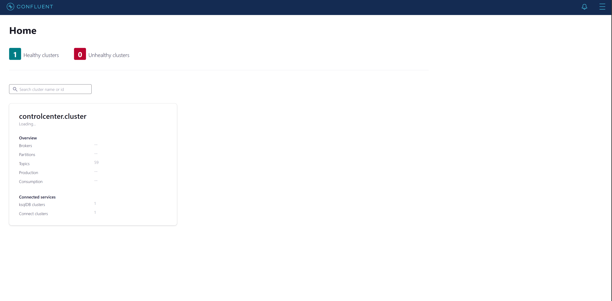
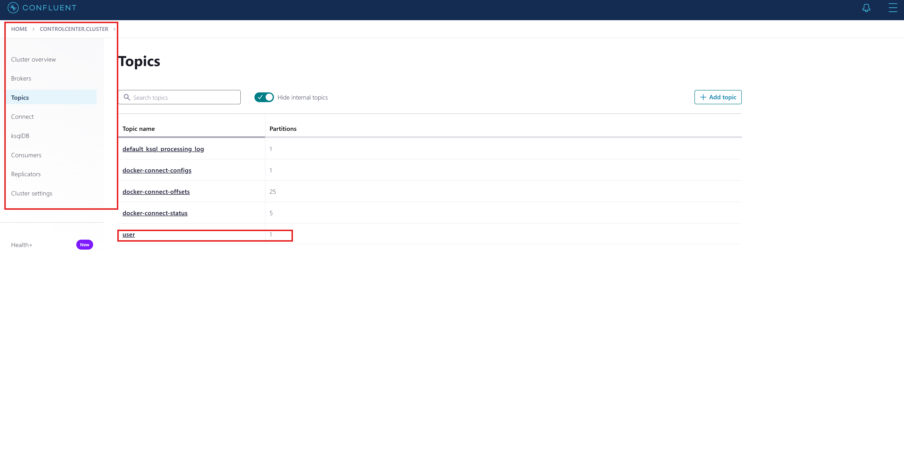
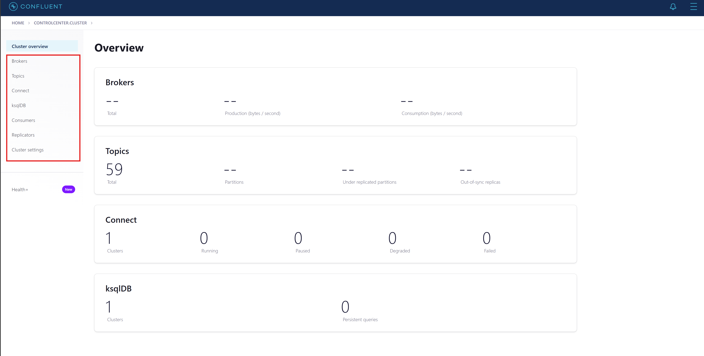
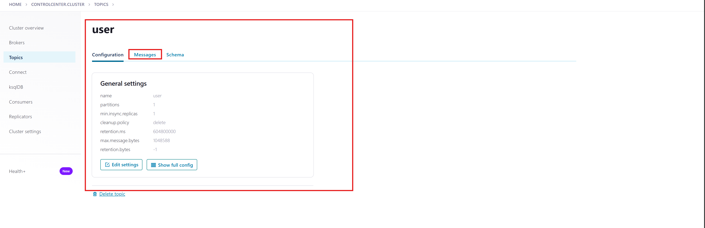
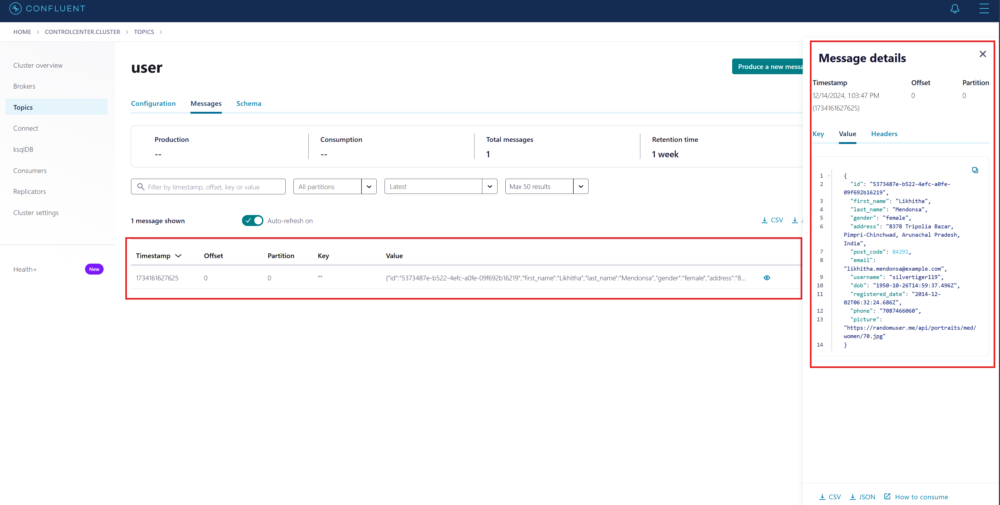
2. **Airflow**: Triggers DAG (`kafka_stream.py`) to ensure Kafka is ingesting data.
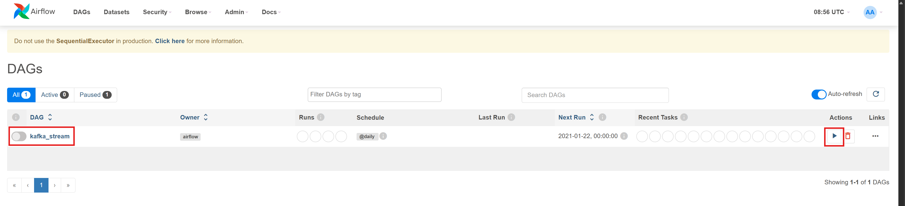
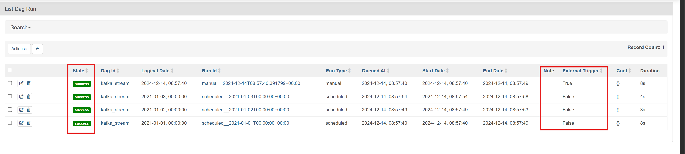
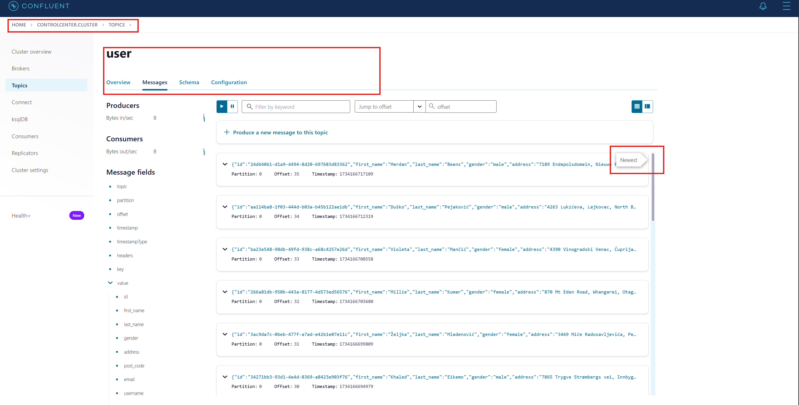
3. **Spark**: Reads data from Kafka topics, processes it, and prepares it for storage.
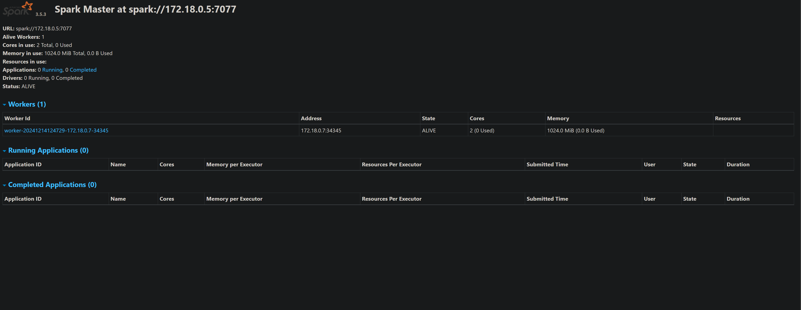
4. **Cassandra**: Stores the processed data efficiently for querying.
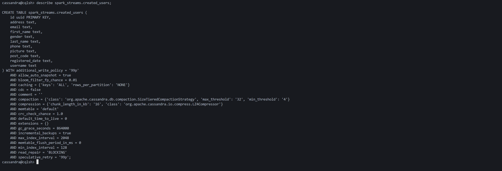
5. **Docker-Compose-yml**: Streamlines deployment of all components as containers.
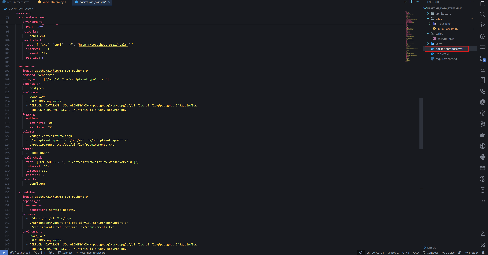
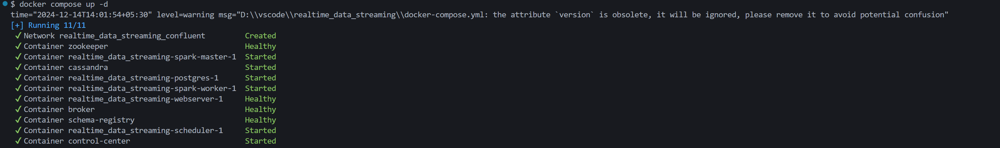
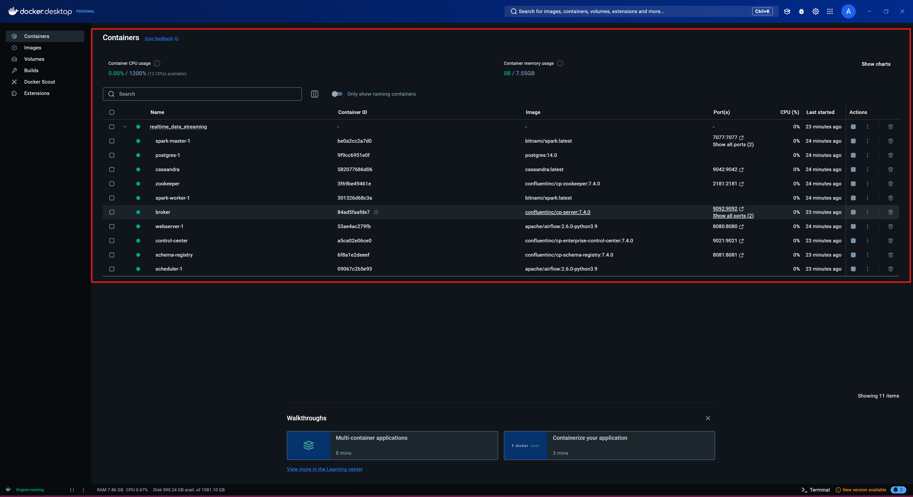
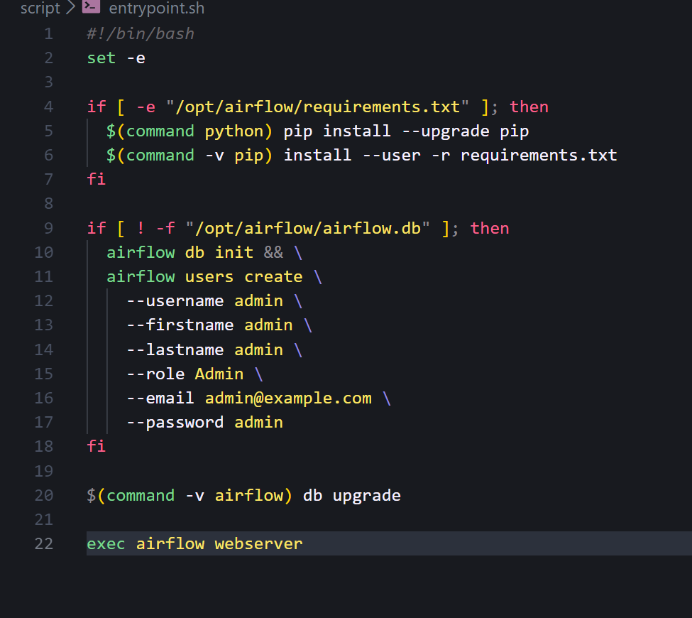

---

## Key Files Explained
- **dags/kafka_stream.py**: Airflow DAG to manage Kafka ingestion workflows.
- **spark_stream.py**: Contains Spark Streaming logic to consume Kafka messages and process data.
- **docker-compose.yml**: Orchestrates the services required for the pipeline.
- **script/entrypoint.sh**: Shell script to initialize necessary configurations during container startup.
- **requirements.txt**: Lists all required Python libraries for the project.

---

## Future Enhancements
- Add monitoring and alerting using **Prometheus** and **Grafana**.
- Include **schema registry** for better Kafka topic management.
- Integrate machine learning components for real-time analytics.

---

## Contributing
Feel free to open pull requests or issues if you'd like to contribute or enhance the project.

---

## License
This project is licensed under the MIT License.

---

## Author
aakashsyadav1999@gmail.com
